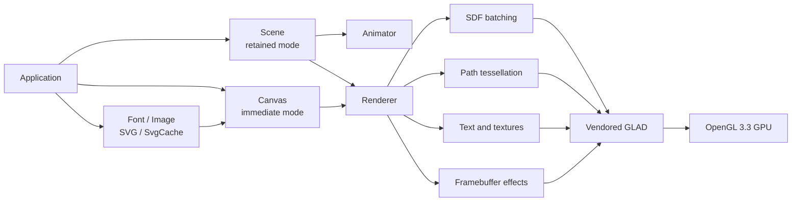
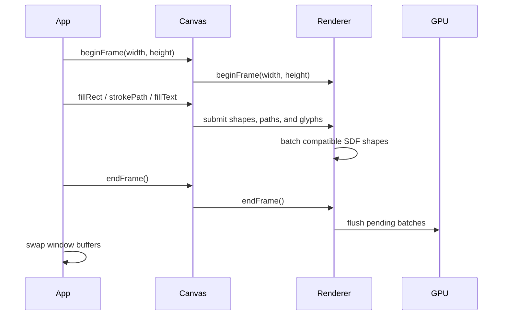

# VectorGL Architecture and Code Flow

This document explains how VectorGL's public APIs, scene graph, asset loaders,
renderer, shaders, and OpenGL resources fit together.

## System overview



VectorGL provides two front ends over one renderer:

- `Canvas` is immediate mode. The application submits drawing operations every
  frame and controls their order directly.
- `Scene` is retained mode. Nodes preserve geometry, style, transforms,
  hierarchy, effects, and animation state between frames.

Both routes eventually submit work to `Renderer`.

## Main classes

| Class | Responsibility | Owns GPU resources |
|---|---|---:|
| `Canvas` | Drawing state, transform and clip stack, paths, text, images, and frame API | Through `Renderer`, fonts, and images |
| `Scene` | Node ownership, traversal, world-transform updates, and rendering | No |
| `Node` | Persistent geometry, style, transform, children, and effects | No |
| `Animator` | Tween, spring, and keyframe progression | No |
| `Renderer` | Batching, shaders, buffers, textures, framebuffers, and draw submission | Yes |
| `Path2D` | Path commands and curve tessellation inputs | No |
| `Font` | TrueType data, glyph metrics, and texture atlas | Yes |
| `Image` | Decoded raster image and OpenGL texture | Yes |
| `SvgImage` | Parsed SVG document and render commands | Indirectly |
| `SvgCache` | Reusable SVG asset handles | Indirectly |
| `TextBox` | Editing, selection, caret, and text layout state | No |
| `GlfwTextBoxController` | Optional GLFW input adapter for `TextBox` | No |

## Immediate-mode frame flow



`beginFrame()` resets Canvas drawing state and establishes framebuffer
dimensions. SDF primitives are accumulated and flushed when the batch fills,
rendering state changes, an effect begins, or the frame ends.

Rectangular clipping is part of Canvas state. `clipRect()` transforms the four
corners, intersects the resulting axis-aligned bounds with any existing clip,
and sends the result to Renderer as an OpenGL scissor rectangle. Changing clip
state flushes pending SDF instances first, preserving command order. Effect
passes temporarily disable scissoring while capturing off-screen content and
restore it before compositing.

## Retained-mode scene flow

1. The application creates nodes through `Scene`.
2. Parent-child relationships establish transform inheritance.
3. `Animator` updates properties using frame delta time.
4. `Scene::update()` resolves world transforms and dirty state.
5. `Scene::render()` traverses visible nodes.
6. Each node submits its geometry and style to `Renderer`.
7. Nodes with effects are captured into an off-screen framebuffer before
   blur, shadow, or glow compositing.

Scene nodes do not own OpenGL objects. This keeps scene mutation separate from
GPU resource lifetime.

## Rendering paths

### SDF primitives

Rectangles, rounded rectangles, circles, and ellipses use signed-distance-field
shaders. `Renderer` stores compatible shapes in an instance buffer and renders
them together.

### Complex paths

`Path2D` records commands and approximates curves with line segments. Filled
subpaths are triangulated before upload. Strokes are expanded into triangles.
This path is flexible but more CPU-intensive than SDF primitives.

### Text and images

Fonts use stb_truetype to generate a glyph atlas. Images use stb_image and are
uploaded as textures. Both are rendered through textured quads.

### Effects

Blur, shadow, and glow use two reusable framebuffer/texture pairs:

1. Capture content into the primary effect texture.
2. Apply horizontal blur into the secondary texture.
3. Apply vertical blur back into the primary texture.
4. Composite the result into the main framebuffer.

## GPU resource lifetime

A valid, current OpenGL context and a loaded GLAD function table are required
before `Canvas::init()` or `Renderer::init()`.

```cpp
glfwMakeContextCurrent(window);
gladLoadGL(glfwGetProcAddress);

vectorgl::Canvas canvas;
canvas.init();

// Render frames...

canvas.destroy();          // Release GPU resources first.
glfwDestroyWindow(window); // Destroy the context second.
```

The renderer validates initialization, frame nesting, framebuffer dimensions,
and effect-pass ordering. Debug builds also enable OpenGL debug output when the
driver supports OpenGL 4.3 or `KHR_debug`.

## Source layout

```text
include/PublicHeaders/vectorgl/   Public C++ API
include/InternalHeaders/         Internal RAII and shader helpers
src/                             Canvas, renderer, scene, assets, animation
src/svg/                         SVG parser and rendering implementation
shaders/                         Runtime and embedded GLSL sources
third_party/glad/                Vendored OpenGL 3.3 loader
example/                         Runnable applications
tests/                           Unit, GPU, and package-consumer tests
cmake/                           Dependencies, tooling, and package config
docs/                            GitHub Pages documentation
```

## Build and package flow

The top-level CMake project compiles VectorGL as a static library. GLAD is
compiled directly into that library. stb is a private build dependency. GLFW is
only discovered or fetched when examples or GPU integration tests are enabled.

The install step exports `vectorgl::vectorgl` and installs public headers,
shaders, and package configuration files. CI then builds a separate consumer
with `find_package(vectorgl CONFIG REQUIRED)` to verify the exported package.

## Adding a feature

- Public types and methods belong in `include/PublicHeaders/vectorgl`.
- Implementation details belong in `src` or `include/InternalHeaders`.
- New shaders must be added to `VECTORGL_SHADER_FILES` so they are copied,
  embedded, and installed.
- CPU behavior should receive a focused unit test.
- GPU behavior should extend `tests/gpu_tests.cpp`.
- Public behavior should be documented in the guides and API reference.
- Keep optional window-system integrations outside the core rendering target.
