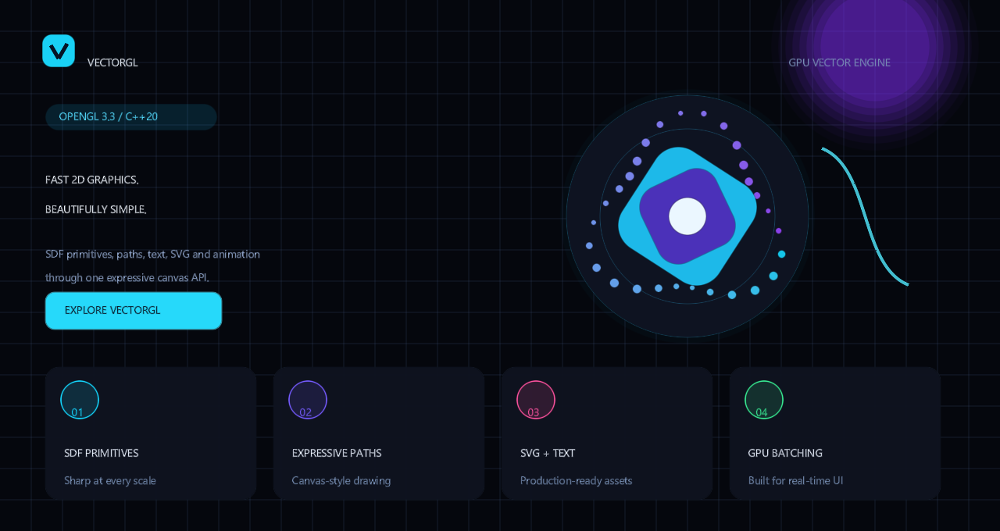

# VectorGL

[](https://github.com/mahtab04/vectorgl/actions/workflows/build.yml)
[](https://github.com/mahtab04/vectorgl/releases/latest)
[](./LICENSE)
[](https://en.cppreference.com/w/cpp/20)
[](https://www.khronos.org/opengl/)

[Documentation](https://mahtab04.github.io/vectorgl/) ·
[Architecture](ARCHITECTURE.md) ·
[Examples](https://mahtab04.github.io/vectorgl/examples.html) ·
[API Reference](https://mahtab04.github.io/vectorgl/api.html) ·
[Guides](https://mahtab04.github.io/vectorgl/guides.html) ·
[Releases](https://github.com/mahtab04/vectorgl/releases)

> A GPU-accelerated 2D vector graphics library for C++20, built on OpenGL 3.3 Core.

[](example/showcase.cpp)

_The scene above is rendered in real time by the standalone
[`vectorgl_showcase`](example/showcase.cpp) example._

VectorGL provides two complementary APIs:

- **Canvas** — an immediate-mode, HTML5 Canvas-style drawing surface with SDF-accelerated shape primitives.
- **Scene** — a retained-mode scene graph with animations, effects, and hierarchical node composition.

It also includes an SVG loader, TrueType font rendering, and a post-processing effects pipeline (blur, shadow, glow).

---

## ✨ Features

| Feature | Description |
|---|---|
| **SDF Primitives** | Rectangles, circles, ellipses, and rounded rectangles rendered on the GPU via signed distance fields — hundreds of shapes in a single draw call. |
| **Path Rendering** | Lines, cubic/quadratic Bézier curves, arcs, and ellipses with adaptive tessellation and antialiased contours. |
| **SVG Support** | Load and render SVG files via `SvgImage` (single file) or `SvgCache` (handle-based asset manager). |
| **Text Rendering** | TrueType fonts rasterized to a GPU texture atlas via `stb_truetype`. |
| **Animation System** | Tween (22 easing curves), spring (critically-damped), and keyframe animations with loop/ping-pong modes. |
| **Post-Processing** | FBO-based Gaussian blur, drop shadows, and outer glow — composable via a fluent `EffectChain` API. |
| **Scene Graph** | Parent/child hierarchy with transform inheritance, dirty tracking, and z-index ordering. |
| **Paint System** | Solid colors, linear/radial gradients, and texture patterns. |
| **Nested Clipping** | Transformed rectangular and rounded clipping with intersection, reset, and automatic `save()` / `restore()` state. |

---

## 📋 Requirements

| Requirement | Minimum Version |
|---|---|
| C++ Standard | C++20 |
| Compiler | MSVC 2022, GCC 12+, or Clang 15+ |
| CMake | 3.20+ |
| GPU | OpenGL 3.3 capable; 8-bit stencil buffer for rounded clipping |

> All other dependencies are fetched automatically via **CMake FetchContent**.

---

## 🔧 Dependencies

| Dependency | Version | Purpose |
|---|---|---|
| [GLFW](https://www.glfw.org/) | 3.3.8 | Window/context management *(examples only)* |
| [glad](https://github.com/Dav1dde/glad) | 2.0.8 | Vendored OpenGL 3.3 loader |
| [stb](https://github.com/nothings/stb) | latest | Image loading (`stb_image`) and font rasterization (`stb_truetype`) |

---

## 🏗️ Building

For prerequisites, troubleshooting, and contribution steps,
see [Building and Contributing](CONTRIBUTING.md).

### Windows helper

```bat
scripts\build.bat -Configuration Debug
```

The helper works from PowerShell or Command Prompt. It detects the available
toolchain, builds examples, deploys MinGW runtime DLLs when needed, and runs
tests. See the contribution guide for direct PowerShell usage and options.

Linux and macOS users can run:

```bash
./scripts/build.sh
```

Visual Studio is optional on Windows: the helper also detects MinGW-w64,
Ninja with GCC/Clang, and NMake developer environments.

GitHub Actions tests both Debug and Release with Windows MSVC and Windows
MinGW GCC/Ninja, in addition to Linux GCC.

### Standard CMake

```bash
# Configure
cmake -S vectorgl -B build

# Build
cmake --build build --config Debug

# Build the flagship showcase
cmake --build build --config Debug --target vectorgl_showcase
```

### Using CMake Presets

```bash
cmake --preset windows-debug
cmake --build --preset windows-debug
```

---

## 🚀 Quick Start

### Immediate-Mode Canvas

```cpp
#include <vectorgl/canvas.hpp>

// After creating an OpenGL 3.3 context:
vectorgl::Canvas canvas;
canvas.init();

// Each frame:
canvas.beginFrame(fbWidth, fbHeight);

canvas.setFillColor(vectorgl::Color::hex(0x3366FF));
canvas.fillRoundedRect(50, 50, 300, 200, 12);

canvas.setStrokeColor(vectorgl::Color::White);
canvas.setLineWidth(2.0f);
canvas.strokeCircle(400, 150, 60);

canvas.beginPath();
canvas.moveTo(500, 50);
canvas.bezierCurveTo(550, 0, 650, 100, 700, 50);
canvas.stroke();

canvas.endFrame();
```

### Retained-Mode Scene Graph

```cpp
#include <vectorgl/canvas.hpp>
#include <vectorgl/scene.hpp>

vectorgl::Scene scene(canvas.renderer());

auto rect = scene.roundedRect(100, 100, 200, 150, 8);
rect->setFill(vectorgl::Color::Blue);
rect->setShadow(8.0f, {4, 4}, vectorgl::Color{0, 0, 0, 0.3f});

// Animate
vectorgl::AnimTarget from, to;
from.x = 100; from.mask = vectorgl::AnimTarget::PosX;
to.x   = 500; to.mask   = vectorgl::AnimTarget::PosX;

scene.animator().emplace<vectorgl::TweenAnimation>(
    rect->id(), from, to, 2.0f, vectorgl::Ease::OutCubic);

// Each frame:
scene.update(dt);
scene.render();
```

### SVG Rendering

```cpp
#include <vectorgl/svg.hpp>

vectorgl::SvgImage svg;
svg.load("icon.svg");
svg.render(canvas, 10.0f, 10.0f, 64.0f, 64.0f);
```

### Text Input & UI Widgets

VectorGL includes a small widget layer for common UI building blocks:

- `vectorgl::TextBox` — single-line text editing
- `vectorgl::GlfwTextBoxController` — forwards GLFW input events
- `vectorgl::ui::Label` / `vectorgl::ui::Button` — simple text and button elements

```cpp
#include <vectorgl/canvas.hpp>
#include <vectorgl/glfw_text_box.hpp>
#include <vectorgl/ui.hpp>

AppState app;
app.canvas.init();
app.field.setBounds(40.0f, 140.0f, 460.0f, 52.0f);
app.field.setFont(fontPath, 24.0f);
app.field.setPlaceholder("Type here");

app.button.setBounds(530.0f, 140.0f, 160.0f, 52.0f);
app.button.setText("Load Sample");

app.textInput.bind(app.field, app.canvas, window);
```

> 💡 The full working sample lives in `example/text_input_demo.cpp` — use it for the complete version with styling, hover state, selection, clipboard shortcuts, and status text.

---

## 📁 Project Structure

```
vectorgl/
├── CMakeLists.txt
├── cmake/                  # CMake modules (dependencies, tooling)
├── include/
│   └── PublicHeaders/
│       └── vectorgl/       # Public API headers
│           ├── canvas.hpp
│           ├── color.hpp
│           ├── path.hpp
│           ├── image.hpp
│           ├── font.hpp
│           ├── renderer.hpp
│           ├── node.hpp
│           ├── scene.hpp
│           ├── animator.hpp
│           ├── effects.hpp
│           ├── paint.hpp
│           ├── svg.hpp
│           └── svg_cache.hpp
├── src/                    # Implementation files
│   └── svg/                # SVG parser modules
├── shaders/                # GLSL shaders (SDF, path, textured, blur)
└── example/                # Demo applications
    ├── main.cpp            # SDF + scene graph demo
    ├── svg_demo.cpp        # SVG rendering demo
    ├── animation_demo.cpp  # Animation showcase
    ├── paths_demo.cpp      # Complex path rendering
    └── ...
```

---

## 🔌 Integration

### Via `find_package` *(after installing)*

```cmake
find_package(vectorgl REQUIRED)
target_link_libraries(myapp PRIVATE vectorgl::vectorgl)
```

### Via `add_subdirectory`

```cmake
add_subdirectory(vectorgl)
target_link_libraries(myapp PRIVATE vectorgl::vectorgl)
```

### Via `FetchContent`

```cmake
include(FetchContent)

FetchContent_Declare(vectorgl
    GIT_REPOSITORY https://github.com/mahtab04/vectorgl.git
    GIT_TAG        v1.0.0
)

FetchContent_MakeAvailable(vectorgl)
target_link_libraries(myapp PRIVATE vectorgl::vectorgl)
```

---

## 📖 Documentation

The complete documentation is published as a browsable site:

- [Documentation home](https://mahtab04.github.io/vectorgl/)
- [Overview and architecture](https://mahtab04.github.io/vectorgl/overview.html)
- [Usage guides](https://mahtab04.github.io/vectorgl/guides.html)
- [API reference](https://mahtab04.github.io/vectorgl/api.html)
- [Example gallery](https://mahtab04.github.io/vectorgl/examples.html)

The source for the static site lives in [`docs/`](./docs). Every push to
`main` deploys that directory through the GitHub Pages workflow.

---

## ✅ Build and test status

The [Build and Test workflow](https://github.com/mahtab04/vectorgl/actions/workflows/build.yml)
compiles and tests all four supported CI configurations:

- Linux GCC Debug
- Linux GCC Release
- Windows MSVC Debug
- Windows MSVC Release

Version tags matching `v*` run the release pipeline and publish installable
Windows and Linux archives. See [Releases](https://github.com/mahtab04/vectorgl/releases).

---

## 📄 License

See [LICENSE](./LICENSE) for details.
